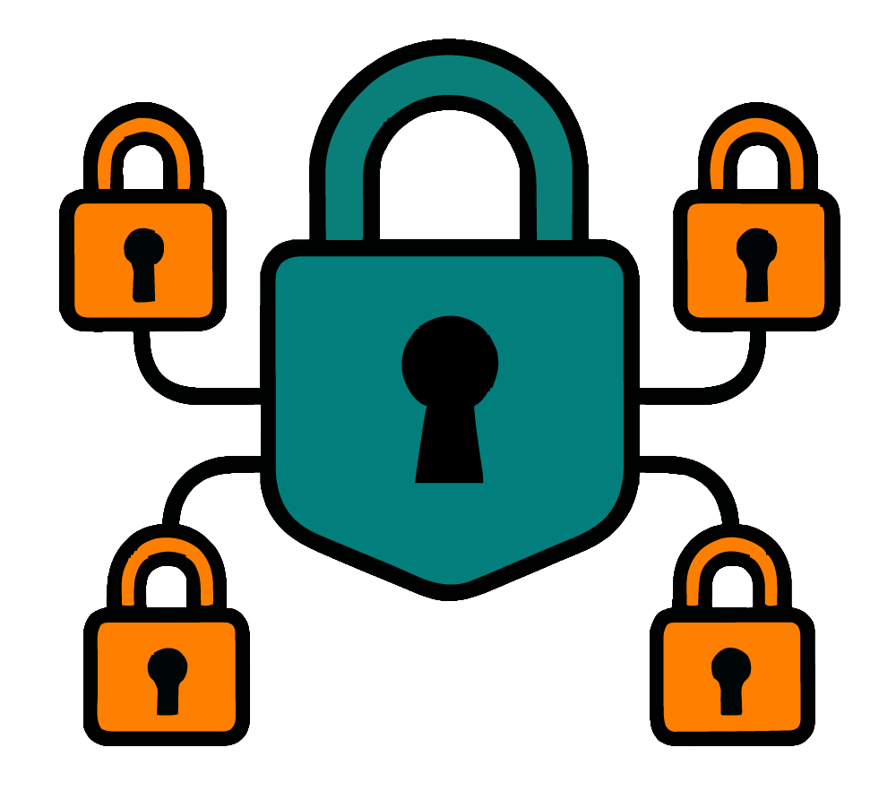

<div align="center">

# Certbot Manager

<!-- TODO: Replace with actual badge SVGs or URLs -->
[](go.mod)
[](https://github.com/jcbasso/certbot-manager/releases)
[](https://creativecommons.org/licenses/by-nc-sa/4.0/)

Go application to automatically obtain and renew multiple Let's Encrypt certificates using Certbot, configured via a
TOML file. Designed to run alongside a reverse proxy like Nginx.

<a href="#">
    
</a>

</div>

---

## Features

* Automated certificate acquisition via Certbot.
* Automated certificate renewal via Certbot through Go cron scheduler.
* Declarative configuration using a TOML file (`config.toml`).
* Support for different Certbot authenticators (`webroot`, `dns-duckdns`).
* Customizable Certbot arguments per certificate.
* Leveled logging controllable via flags or environment variables.
* Designed for containerized environments (Docker).
* Open to extensibility for additional features, flags and authenticator plugins.

## Standalone Usage

> [!IMPORTANT]
> Since `certbot-manager` leverages Certbot, you must first install Certbot separately on your system if running
> standalone.
> See [Certbot Installation](https://certbot.eff.org/instructions) for instructions.

1. Download the latest binary from the [Releases](https://github.com/jcbasso/certbot-manager/releases) page.
2. Create your `config.toml` file (see [Configuration](#configuration) section below and the
   detailed [Configuration Details](docs/configurations.md) document).
3. Ensure required environment variables (like `DUCKDNS_TOKEN`) are set if needed.
4. Run the binary:
   ```bash
   # Example: Use a config file in the current directory
   ./certbot-manager --config=./config.toml --log-level=debug

   # Example: Specify a different path
   ./certbot-manager -c /etc/certbot-manager/config.toml
   ```

## Docker Compose Usage

This application is primarily intended to be run as a Docker container using Docker Compose, alongside your web
server/proxy container. The Certbot dependency is included in the Docker image.

```yaml
services:
  certbot-manager:
    image: ghcr.io/jcbasso/certbot-manager:latest
    container_name: certbot-manager
    env_file:
      - .env
    volumes:
      - ./config.toml:/app/config.toml:ro
      - letsencrypt_data:/etc/letsencrypt
      - acme_challenge_webroot:/var/www/acme-challenge
    restart: unless-stopped

volumes:
  letsencrypt_data:
  acme_challenge_webroot:
```

**Steps:**

1. Create your `config.toml` file in the same directory as your `docker-compose.yml` (or adjust the volume mount). See
   the [Configuration](#configuration) summary below and the detailed [Configuration Details](docs/configurations.md)
   document.
2. If using DNS authenticators requiring secrets (like DuckDNS), create a `.env` file in your project root containing
   the secrets (e.g., `DUCKDNS_TOKEN=your_secret_token`).
3. Ensure your `docker-compose.yml` correctly defines the `certbot-manager` service and shared volumes.
4. Run `docker compose up -d` to start the service (add `--build` if building locally).

## Configuration

`certbot-manager` is configured primarily through a TOML file (e.g., `config.toml`). Settings can also be overridden by command-line arguments and environment variables. The order of precedence is: **Command-Line Flags > Environment Variables > Config File > Built-in Defaults**.

The `config.toml` file allows you to define global settings and then specify individual certificates to manage.

**Example `config.toml` Structure:**

```toml
# Global settings that apply to all certificates unless overridden
[globals]
    email = "admin@example.com"
    renewal_cron = "0 0 0,12 * * *"
    cmd = "certonly"

# Define one or more certificates to manage
[[certificate]]
    domains = ["example.com", "www.example.com"]
    authenticator = "webroot"
    webroot_path = "/var/www/acme-challenge"

[[certificate]]
    domains = ["my-domain.duckdns.org"]
    authenticator = "dns-duckdns"
    duckdns_token = "123456-78910"
    dns_propagation_seconds = "60"
    args = "--vvv --nginx"
```

**Key Configuration Sections:**

*   **`[globals]`**: Define default settings here, such as your primary email address for Let's Encrypt, whether to use the staging (test) or production environment, the default Certbot command (like `certonly`), and the cron schedule for renewal checks.
*   **`[[certificate]]`**: Create one of these sections for each certificate you need.
    *   List the `domains` the certificate will cover.
    *   Specify the `authenticator` method Certbot should use to verify domain ownership (e.g., `webroot` or `dns-duckdns`).
    *   You can also override any global settings specifically for this certificate or add custom `args` for fine-grained control over Certbot's behavior.

> [!TIP]
> *   The example above is a simplified overview. For a **complete list of all configuration options**, their descriptions, default values, and details on using command-line flags and environment variables, please refer to the **[Configuration Details](docs/configurations.md)** document.
> *   A more comprehensive example configuration file is available at [config.toml](./example.config.toml). <!-- TODO: Create/link this example file -->

## Supported Authenticators

The `authenticator` field in the `[[certificate]]` section of your `config.toml` determines how domain ownership is
verified:

* `webroot` (Default): Uses the HTTP-01 challenge. Requires your web server (e.g., Nginx) to be configured to serve
  files from the `webroot_path` for the `/.well-known/acme-challenge/` URI.
* `dns-duckdns`: Uses the DNS-01 challenge via
  the [infinityofspace/certbot_dns_duckdns](https://github.com/infinityofspace/certbot_dns_duckdns) plugin. Requires
  the `DUCKDNS_TOKEN` environment variable to be set.

<!-- TODO: Add more authenticators here as they are implemented -->

## Development

* Requires Go version specified in [go.mod](go.mod).
* Follow [git branching model & release specifications](docs/git-branching-model.md).

## License

This project is licensed under
the [Creative Commons Attribution-NonCommercial-ShareAlike 4.0 International License](LICENSE).